# Pipeline Hiện Tại

Sơ đồ dưới đây mô tả pipeline hiện tại của hệ thống theo đúng hướng triển khai trong `src`.

- Không dùng logic cũ kiểu `compact draft -> compact skeleton`.
- Problem side và student side đều đi theo hướng:
  - heuristic anchors
  - LLM semantic sketch
  - local compile/build
  - validation/retry
  - fallback khi cần

```mermaid
flowchart LR

    problem_text([problem_text])
    student_answer([student_answer])

    subgraph P1[Problem Side]
        p_heur["Heuristic Parse\n- sentence spans\n- numeric mentions\n- lexical cues\n- target candidates\n=> problem_evidence_pack + heuristic_problem"]
        p_llm["LLM Semantic Sketch\ninput:\n- problem_text\n- problem_evidence_pack\n- heuristic_problem\noutput:\n- problem_semantic_sketch"]
        p_build["Local Build / Compile\n- compile quantities\n- build target\n- build relations\n- build problem graph\n=> FormalizedProblem"]
        p_validate{"Validate /\nRetry ?"}
        p_fallback["Fallback Heuristic Problem"]
        formalized_problem[[FormalizedProblem]]
        problem_graph[(problem_graph)]
    end

    subgraph P2[Runtime Reference]
        r_build["Build Solver Candidate"]
        r_compile["Compile Executable Plan\nfrom problem graph / relation fallback"]
        executable_plan[(ExecutablePlan)]
        r_execute["Execute Plan"]
        execution_trace[(ExecutionTrace)]
        r_package["Package Canonical Reference"]
        canonical_reference[[CanonicalReference]]
    end

    subgraph P3[Student Side]
        s_heur["Heuristic Parse\n- extract final answer\n- split student steps\n- build heuristic state\n=> heuristic_student_state"]
        s_llm["LLM Semantic Sketch\ninput:\n- student_answer\n- FormalizedProblem\n- CanonicalReference\n- heuristic_student_state\noutput:\n- student_semantic_sketch"]
        s_build["Local Build / Compile\n- build student steps\n- repair target ref\n- reconcile mode\n- prune semantic facts\n- build student graph\n=> StudentWorkState"]
        s_validate{"Validate /\nRetry ?"}
        s_fallback["Fallback Heuristic Student State"]
        student_work[[StudentWorkState]]
        student_graph[(student_graph)]
    end

    subgraph P4[Evidence]
        e_project["Project Reference + Student\ninto alignment payloads"]
        e_align["Global Alignment\n+ target/path inference\n+ graph edit summary"]
        diagnosis_evidence[[DiagnosisEvidence]]
    end

    subgraph P5[Diagnosis]
        d_score["Deterministic Scoring\nof hypotheses"]
        d_llm["Optional LLM Review"]
        diagnosis_result[[DiagnosisResult]]
    end

    subgraph P6[Pedagogy]
        h_plan["Build Hint Plan\nfrom problem + reference + diagnosis"]
        hint_plan[[HintPlan]]
    end

    subgraph P7[Hint]
        h_generate["Generate Hint Text\n- deterministic or LLM"]
        hint_text[(hint_text)]
        h_verify["Verify Hint\n- no spoiler\n- alignment"]
        h_repair["Repair or Fallback"]
        hint_result[[HintResult]]
    end

    problem_text --> p_heur
    p_heur --> p_llm
    problem_text --> p_llm
    p_llm --> p_build
    p_heur --> p_build
    p_build --> p_validate
    p_validate -- pass --> formalized_problem
    p_validate -- pass --> problem_graph
    p_validate -- retry --> p_llm
    p_validate -- fallback --> p_fallback
    p_fallback --> formalized_problem

    formalized_problem --> r_build
    formalized_problem --> r_compile
    problem_graph --> r_compile
    r_compile --> executable_plan
    executable_plan --> r_execute
    r_execute --> execution_trace
    formalized_problem --> r_package
    executable_plan --> r_package
    execution_trace --> r_package
    r_package --> canonical_reference

    student_answer --> s_heur
    s_heur --> s_llm
    student_answer --> s_llm
    formalized_problem --> s_llm
    canonical_reference --> s_llm
    s_llm --> s_build
    s_heur --> s_build
    formalized_problem --> s_build
    canonical_reference --> s_build
    s_build --> s_validate
    s_validate -- pass --> student_work
    s_validate -- pass --> student_graph
    s_validate -- retry --> s_llm
    s_validate -- fallback --> s_fallback
    s_fallback --> student_work

    formalized_problem --> e_project
    canonical_reference --> e_project
    student_work --> e_project
    e_project --> e_align
    e_align --> diagnosis_evidence

    diagnosis_evidence --> d_score
    d_score --> d_llm
    d_llm --> diagnosis_result

    formalized_problem --> h_plan
    canonical_reference --> h_plan
    diagnosis_result --> h_plan
    h_plan --> hint_plan

    formalized_problem --> h_generate
    canonical_reference --> h_generate
    diagnosis_result --> h_generate
    hint_plan --> h_generate
    h_generate --> hint_text
    hint_text --> h_verify
    hint_plan --> h_verify
    h_verify --> h_repair
    formalized_problem --> h_repair
    canonical_reference --> h_repair
    diagnosis_result --> h_repair
    hint_plan --> h_repair
    h_repair --> hint_result
```

## Ghi chú ngắn

- `FormalizedProblem` là output cuối của problem side.
- `CanonicalReference` là lời giải chuẩn executable nội bộ.
- `StudentWorkState` là biểu diễn có cấu trúc của bài làm học sinh.
- `DiagnosisEvidence` là lớp so sánh giữa reference và student work.
- `DiagnosisResult` là nhãn lỗi cuối cùng.
- `HintPlan` là kế hoạch sư phạm.
- `HintResult` là hint cuối trả ra cho người học.
