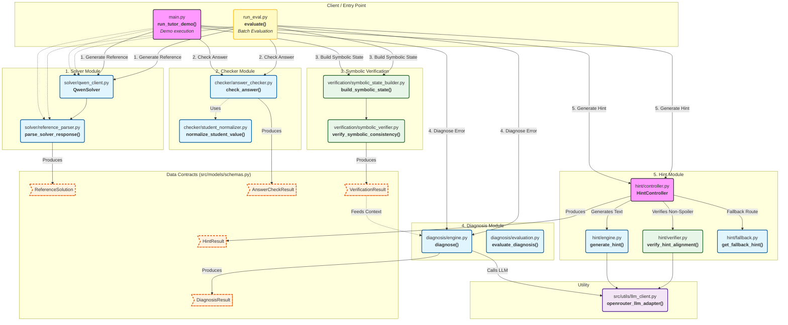

# Project Architecture & Code Structure

This document serves as a comprehensive overview of the **Neuro-Symbolic Solver-Grounded Tutor for Math Word Problems** project. It outlines the directory structure, describes every module and file, documents key functions, and explains how all components connect together to form the complete end-to-end pipeline.

---

## 🏗️ 1. Architecture Mermaid Diagram

Below is the detailed architecture visualization showing how data flows through the application's core modules:



---

## 📂 2. Folder Structure

```text
Dự án/
├── main.py                     # E2E single-problem interactive demo script
├── run_eval.py                 # Batch evaluation harness for GSM8K dataset
├── .env                        # Environment variables (e.g., OPENROUTER_API_KEY)
└── src/                        # Main source code directory
    ├── checker/                # Module 2: Parses & checks student answers
    ├── dataset/                # Module: Handles dataset loading and initial parsing
    ├── diagnosis/              # Module 4: Categorizes the student's mistake
    ├── hint/                   # Module 5: Generates & verifies pedagogical hints
    ├── models/                 # Shared domain schemas and data contracts
    ├── solver/                 # Module 1: Generates the reference solutions
    ├── utils/                  # Helper utilities (API calls)
    └── verification/           # Module 3: Grounded mathematical checks
```

---

## 🔍 3. Module & Function Drill-Down

### 🔹 Entry Points (Root Level)

#### `main.py`
- **Purpose**: Runs the entire educational pipeline end-to-end on a single hardcoded problem (interactive demo).
- **Functions**:
  - `run_tutor_demo()`: Orchestrates the 5 steps: Generating Reference Solution -> Checking Answer -> Building Symbolic Evidence -> Diagnosing Student Error -> Generating Pedagogical Hint. Connects the pipeline using `openrouter_llm_adapter()`.

#### `run_eval.py`
- **Purpose**: Batch evaluation harness for testing the logic over a subset of the GSM8K dataset.
- **Functions**:
  - `evaluate(split, limit)`: Iterates over N dataset items, executes the solver/checker/verifier/diagnosis/hint pipeline automatically, and records statistics (parser success, spoiler-free rate, hint alignment rate, verification status distribution).

---

### 🔹 `src/models/` (Data Contracts)

#### `schemas.py`
- **Purpose**: Contains all Pydantic models (data schemas) used to pass information safely between pipeline stages.
- **Key Models**:
  - `SolverResponse`: Raw output structure and metadata from the LLM math solver.
  - `ReferenceSolution`: The parsed, structured reference (contains `final_answer` and `solution_text`).
  - `AnswerCheckResult`: Indicates if the student is correct, their numeric value, and comparison type.
  - `SymbolicState`: Mathematical concepts extracted (equations, terms). 
  - `VerificationResult`: The outcome of cross-referencing student math logic against the true symbolic state.
  - `DiagnosisResult`: Final labeled diagnosis of *why* the student failed.
  - `HintResult`: The generated hint text along with its severity level and fallback status.

---

### 🔹 `src/utils/` (Utilities)

#### `llm_client.py`
- **Purpose**: Manages communication with external LLM inference providers.
- **Functions**:
  - `openrouter_llm_adapter(prompt: str) -> str`: Calls OpenRouter API over HTTP `requests` using standard OpenAI payload formats. Removes strict boundaries/rate-limits of HuggingFace.

---

### 🔹 `src/dataset/`

#### `gsm8k_loader.py`
- **Purpose**: Fetches the GSM8K dataset and extracts records.
- **Functions**:
  - `load_gsm8k_from_huggingface()`: Downloads split subsets and extracts `question` and `answer`.

#### `answer_parser.py`
- **Purpose**: Extracts ground truth numeric answers from the text datasets and from noisy model outputs.
- **Functions**:
  - `parse_gsm8k_answer(answer_text)`: Uses 3 fallback Regex layers to pull out numbers wrapped in `#### <num>`, common cues (`final answer is`), or fallback to the last number. Handles noise output seamlessly.

---

### 🔹 `src/solver/` (Module 1)

#### `reference_parser.py`
- **Purpose**: Parses the output of the raw solver into the neat `ReferenceSolution` schema.
- **Functions**:
  - `parse_solver_response(response)`: Validates length, runs `parse_gsm8k_answer()`, applies rules to create the structured response.

#### `qwen_client.py` & `validation.py`
- **Purpose**: Alternative helper wrapper modules for standard model integrations and validation checks of mathematical reasoning traces.

---

### 🔹 `src/checker/` (Module 2)

#### `answer_checker.py`
- **Purpose**: Determines if a student is right or wrong compared to the parsed reference.
- **Functions**:
  - `check_answer(student_raw, reference_value)`: Extracts the student number using `student_normalizer.py`, compares value ranges (accounting for floating precision), and constructs an `AnswerCheckResult` determining correctness.

#### `student_normalizer.py`
- **Purpose**: Dedicated parsing tool for human-written/student answers.
- **Functions**:
  - `normalize_student_value(text)`: Grabs numbers securely from natural language student input.

---

### 🔹 `src/verification/` (Module 3 - Symbolic Layer)

This neuro-symbolic layer removes the reliance on pure prompting for math evaluations, extracting verifiable properties.

#### `symbolic_state_builder.py`
- **Purpose**: Extracts core mathematical formulas and properties out of language contexts (converting words to logic objects).
- **Functions**:
  - `build_symbolic_state(problem_text, reference_text)`: Identifies operators, terms, amounts, and expected semantic paths to solve the problem. Creates a structured `SymbolicState`.

#### `symbolic_verifier.py`
- **Purpose**: Mathematical validation engine.
- **Functions**:
  - `verify_symbolic_consistency(state, check_result)`: Takes the math rules and constraints extracted and compares them to the student's answer format to find contradictions (e.g. they subtracted instead of added, returning `VerificationResult` evidence).

---

### 🔹 `src/diagnosis/` (Module 4)

#### `engine.py`
- **Purpose**: Generates the exact error category for the student based on verifiable state evidence.
- **Functions**:
  - `diagnose()`: Feeds the `VerificationResult` and reference material into the `llm_callable`. Returns a structured `DiagnosisResult` with one of the predefined `DiagnosisLabel` errors (like `quantity_relation_error`).

#### `evaluation.py`
- **Purpose**: Compares system diagnoses against expected labels.
- **Functions**:
  - `evaluate_diagnosis()`: Scores diagnostic accuracy.

---

### 🔹 `src/hint/` (Module 5)

#### `controller.py`
- **Purpose**: The overarching Hint orchestrator ensuring reliability.
- **Functions**:
  - `HintController.get_hint()`: Manages the `generate_hint -> verify_hint_alignment -> get_fallback_hint` lifecycle loop. It ensures constraints are met before exposing hints.

#### `engine.py`
- **Purpose**: AI generation of the pedagogical hint text.
- **Functions**:
  - `generate_hint()`: Instructs LLM based on `Diagnosis` to create a `hint_level` appropriate text that points out flaws without giving answers away.

#### `verifier.py`
- **Purpose**: Gatekeeper logic enforcing "No Spoilers" educational policy.
- **Functions**:
  - `verify_hint_alignment(hint_text, diagnosis_label, expected_level)`: Cross-references the generated hint to avoid numbers, answers, or giving too much context away. If violating, flags it.

#### `fallback.py` & `policy.py`
- **Purpose**: Defines standard hints per diagnosis label to be used if the verifier rejects the LLM generated hint. `policy.py` enumerates the types of acceptable hint levels.
- **Functions**:
  - `get_fallback_hint(diagnosis_label)`: Provides predefined, guaranteed-safe strings like *"Let's double check your arithmetic"* in emergencies.

---

## 🔗 How It All Connects (Execution Flow)

1. A math problem and student response enter the pipeline via `main.py` or `run_eval.py`.
2. A prompt is sent to `llm_client.py` communicating with **OpenRouter**, solving the math problem. The output goes to `reference_parser.py` yielding the math answer.
3. The `answer_checker.py` compares the student number to the real number. If incorrect, we begin the diagnostic phase.
4. Instead of trusting purely text-based LLM, `symbolic_state_builder.py` identifies mathematical operators and bounds.
5. Next, `symbolic_verifier.py` cross checks those bounds against the failed student value to identify mathematical divergence points (evidence).
6. That solid mathematical evidence is parsed to `diagnosis/engine.py` which easily uses the LLM to output a precise `DiagnosisResult` classification.
7. Finally, `hint/controller.py` calls the LLM one last time to write a helpful explanation string (`hint/engine.py`), passes it against strict rule-checks (`hint/verifier.py`), mitigating it via `hint/fallback.py` if spoiled, and finally pushes it safely back to the user interface.
